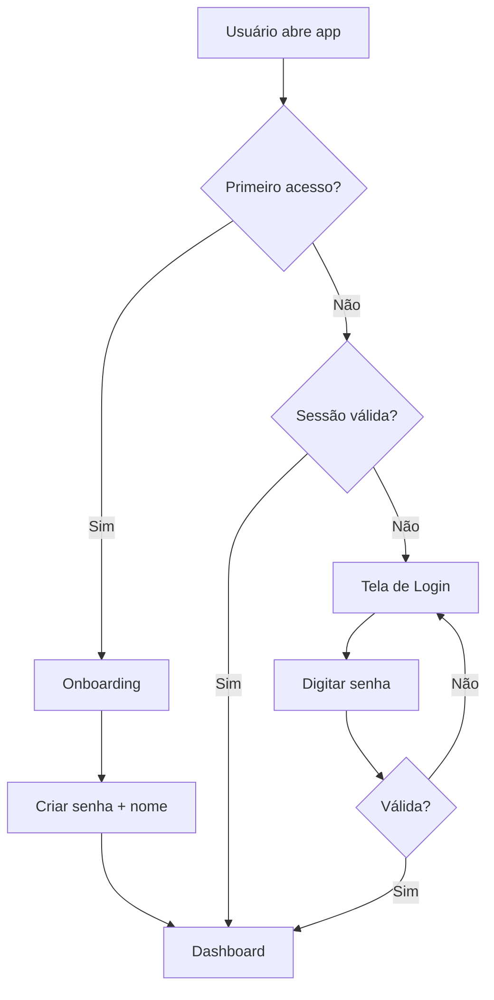

# 📋 Documentação Técnica - Life Matriz

## Visão Geral

**Life Matriz** é um Sistema Operacional da Vida - uma aplicação completa de gestão de vida pessoal com inteligência artificial, projetada para funcionar em múltiplas plataformas (Web, Desktop e Mobile via PWA).

---

## 🛠️ Stack Tecnológico

| Categoria | Tecnologia | Versão |
|-----------|-----------|--------|
| **Framework Web** | Next.js | 16.1.1 |
| **UI Library** | React | 19.2.3 |
| **Linguagem** | TypeScript/JavaScript | 5.x |
| **State Management** | Zustand | 5.0.9 |
| **Animações** | Framer Motion | 12.23.26 |
| **Estilização** | TailwindCSS | 4.x |
| **Backend/Auth** | Supabase | 2.89.0 |
| **IA** | OpenAI SDK | 6.15.0 |
| **Desktop** | Electron | - |
| **Ícones** | Lucide React | 0.562.0 |

---

## 📁 Estrutura do Projeto

```
Life Matriz/
├── src/
│   ├── app/                 # Next.js App Router (páginas)
│   │   ├── api/            # API Routes
│   │   │   ├── ai/         # Endpoints de IA
│   │   │   ├── calendar/   # API de calendário
│   │   │   └── search/     # API de busca
│   │   ├── auth/           # Autenticação
│   │   ├── calendar/       # Módulo Agenda
│   │   ├── career/         # Módulo Carreira
│   │   ├── finance/        # Módulo Finanças
│   │   ├── goals/          # Módulo Objetivos
│   │   ├── habits/         # Módulo Hábitos
│   │   ├── health/         # Módulo Saúde
│   │   ├── journal/        # Diário
│   │   ├── login/          # Tela de Login
│   │   ├── onboarding/     # Onboarding inicial
│   │   ├── notifications/  # Central de Notificações
│   │   ├── search/         # Busca Global
│   │   ├── security/       # Configurações de Segurança
│   │   ├── settings/       # Configurações Gerais
│   │   ├── simulator/      # Simulador (Ifá?)
│   │   ├── tips/           # Dicas e Insights
│   │   ├── page.tsx        # Dashboard Principal
│   │   └── globals.css     # Estilos globais
│   │
│   ├── components/         # Componentes reutilizáveis
│   │   ├── ai/             # Componentes de IA
│   │   ├── auth/           # Componentes de autenticação
│   │   ├── dashboard/      # Cards e widgets do dashboard
│   │   ├── layout/         # Layout principal (Sidebar, etc.)
│   │   ├── modals/         # Modais
│   │   ├── pwa/            # Componentes PWA
│   │   └── search/         # Componentes de busca
│   │
│   ├── contexts/           # React Contexts
│   │
│   ├── hooks/              # Custom React Hooks
│   │
│   └── lib/                # Bibliotecas e stores
│       ├── store.ts        # Store principal (Zustand)
│       ├── authStore.ts    # Gerenciamento de autenticação
│       ├── habitStore.ts   # Gerenciamento de hábitos
│       ├── journalStore.ts # Gerenciamento do diário
│       ├── notificationStore.ts # Sistema de notificações
│       ├── settingsStore.ts # Configurações do app
│       ├── aiStore.ts      # Estado da IA
│       ├── syncStore.ts    # Sincronização de dados
│       └── supabase/       # Cliente Supabase
│           ├── client.ts   # Cliente para browser
│           ├── server.ts   # Cliente para server
│           └── index.ts    # Exports
│
├── electron/               # App Desktop
│   ├── main.js            # Processo principal Electron
│   └── package.json       # Dependências Electron
│
├── public/                 # Assets públicos
│   ├── manifest.json      # PWA Manifest
│   ├── sw.js              # Service Worker
│   └── icons/             # Ícones do app
│
└── package.json           # Dependências do projeto
```

---

## 🧩 Arquitetura de Stores (Zustand)

O app utiliza **Zustand** com persistência para gerenciar estado global.

### 1. Store Principal (`store.ts`)

```typescript
// Tipos principais
interface User { id, email, name, avatar, createdAt }
interface Goal { id, title, description, category, priority, progress, deadline, subgoals }
interface Task { id, title, date, time, type, completed, energy }
interface Transaction { id, title, amount, type, category, date }
interface HealthEntry { id, date, mood, sleepHours, waterIntake, steps, stressLevel }
```

**Funcionalidades:**
- `setUser()` / `logout()` - Autenticação
- `addGoal()` / `updateGoal()` / `deleteGoal()` - Gestão de objetivos
- `addTask()` / `toggleTaskComplete()` - Gestão de tarefas
- `addTransaction()` - Gestão financeira
- `addHealthEntry()` - Registro de saúde
- `calculateLifeScore()` - Cálculo do score de vida

### 2. Auth Store (`authStore.ts`)

```typescript
interface AuthState {
    isAuthenticated: boolean
    user: AuthUser | null
    passwordHash: string | null
    pin: string | null
    sessionTimeout: number  // em minutos
}
```

**Funcionalidades:**
- Login com senha hash (SHA-256)
- PIN rápido para reautenticação
- Controle de sessão com timeout
- Persistência local

### 3. Outros Stores

| Store | Função |
|-------|--------|
| `habitStore.ts` | Rastreamento de hábitos diários |
| `journalStore.ts` | Diário pessoal |
| `notificationStore.ts` | Sistema de notificações |
| `settingsStore.ts` | Preferências do usuário |
| `aiStore.ts` | Estado e histórico da IA |
| `syncStore.ts` | Sincronização com Supabase |

---

## 🖥️ Modo Desktop (Electron)

O Electron permite executar o app como aplicativo nativo Windows/Mac/Linux.

### Configuração (`electron/main.js`)

```javascript
// Janela principal
BrowserWindow({
    width: 1400,
    height: 900,
    minWidth: 1024,
    minHeight: 700,
    backgroundColor: '#0a0a0a'
})
```

### Funcionalidades Nativas

1. **Windows Defender Integration**
   - `getWindowsDefenderStatus()` - Status do antivírus
   - `runVirusScan()` - Iniciar varredura

2. **Links Externos**
   - Abre URLs http/https no navegador padrão
   - Suporte a protocolos Windows (`ms-settings:`, `windowsdefender://`)

---

## 📱 PWA (Progressive Web App)

O app pode ser instalado como aplicativo móvel via navegador.

### Manifest (`public/manifest.json`)

```json
{
    "name": "Life Matriz",
    "short_name": "Life Matriz",
    "display": "standalone",
    "theme_color": "#14b8a6",
    "background_color": "#0a0a0a",
    "lang": "pt-BR"
}
```

### Recursos PWA
- ✅ Instalável no celular/desktop
- ✅ Service Worker para cache offline
- ✅ Ícones em múltiplos tamanhos
- ✅ Shortcuts para acesso rápido (Dashboard, Objetivos, Segurança)
- ✅ Screenshots para store

---

## 🔌 API Routes

### IA (`/api/ai/`)
Endpoints para comunicação com OpenAI:
- Chat com assistente IA
- Geração de insights
- Recomendações personalizadas

### Calendário (`/api/calendar/`)
- Gerenciamento de eventos
- Sincronização

### Busca (`/api/search/`)
- Busca global unificada

---

## 🔐 Sistema de Autenticação

### Fluxo de Login



### Segurança
- Senha hasheada com SHA-256 (+ salt)
- PIN opcional para acesso rápido
- Timeout de sessão configurável (padrão: 30min)
- Persistência em localStorage

---

## 🎨 Design System

### Cores Principais
| Nome | Valor | Uso |
|------|-------|-----|
| Teal | `#14b8a6` | Cor primária, CTAs |
| Background | `#0a0a0a` | Fundo escuro |
| Glass | `rgba(255,255,255,0.05)` | Cards glassmorphism |

### Componentes UI
- `glass-card` - Cards com efeito vidro
- `btn-icon` - Botões de ícone
- Animações com Framer Motion

---

## 📊 Módulos do Sistema

| Módulo | Rota | Função |
|--------|------|--------|
| **Dashboard** | `/` | Visão geral + Life Score |
| **Objetivos** | `/goals` | Metas de vida |
| **Agenda** | `/calendar` | Rotina e eventos |
| **Finanças** | `/finance` | Renda e despesas |
| **Saúde** | `/health` | Bem-estar físico/mental |
| **Carreira** | `/career` | Desenvolvimento profissional |
| **Hábitos** | `/habits` | Tracking diário |
| **Diário** | `/journal` | Reflexões pessoais |
| **IA** | `/ai` | Assistente inteligente |
| **Segurança** | `/security` | Configurações de segurança |
| **Configurações** | `/settings` | Preferências gerais |

---

## 🚀 Como Executar

### Modo Web (Desenvolvimento)
```bash
cd "Life Matriz"
npm install
npm run dev
# Acesse http://localhost:3000
```

### Modo Desktop (Electron)
```bash
cd "Life Matriz/electron"
npm install
npm start
```

### Build Produção
```bash
npm run build
npm start
```

---

## 📝 Observações Técnicas

1. **React 19** - Versão mais recente com novas features
2. **Next.js 16** - App Router com Server Components
3. **Turbopack** - Bundler rápido em desenvolvimento
4. **Supabase** - Backend serverless (auth, database, storage)
5. **TypeScript** - Tipagem estática para segurança

---

## 🐛 Correções Aplicadas (26/12/2025)

### 1. Loop Infinito de Renderização (CRÍTICO)

**Problema:** A aplicação estava atualizando infinitamente (loop de re-render).

**Causas encontradas e corrigidas:**

| Arquivo | Problema | Solução |
|---------|----------|---------|
| `AuthContext.tsx` | `setStoreUser`, `logout` nas deps | Removido das deps |
| `AuthGuard.tsx` | `checkSession`, `updateActivity` nas deps | Removido das deps |
| `VoiceAssistant.tsx` | `isListening`, `transcript` nas deps | Removido das deps |
| `GlobalSearchButton.tsx` | `addEventListener` fora do useEffect | Movido para useEffect |
| `ai/page.tsx` | `createConversation` nas deps | Usado useRef |

**Exemplo de correção:**
```typescript
// ❌ Antes (causava loop)
if (typeof window !== 'undefined') {
    window.addEventListener('keydown', handler);
}

// ✅ Depois (corrigido)
useEffect(() => {
    window.addEventListener('keydown', handler);
    return () => window.removeEventListener('keydown', handler);
}, []);
```

---

## ✨ Novas Funcionalidades (26/12/2025)

### 1. Sistema de Rastreamento de Atividades (Electron)

**Arquivo:** `electron/main.js`

Rastreia automaticamente quais aplicativos o usuário usa no PC:
- Detecta janela ativa a cada 5 segundos
- Contabiliza tempo gasto por app
- Salva histórico diário em JSON
- API exposta: `global.activityAPI`

**Componente UI:** `src/components/dashboard/ActivityTracker.tsx`

### 2. Sistema de IA com Aprendizado Contínuo

**Arquivo:** `src/lib/learningAIStore.ts`

Sistema de memória inteligente que aprende sobre o usuário:

| Feature | Descrição |
|---------|-----------|
| **Memória Contínua** | Armazena fatos, preferências e comportamentos |
| **Feedback Loop** | Usuário avalia respostas (bom/ruim) |
| **Base de Conhecimento** | Extrai automaticamente informações das conversas |
| **Padrões** | Identifica tópicos mais discutidos |
| **Contexto Personalizado** | Gera contexto para IA baseado no histórico |

**Estrutura de dados:**
```typescript
interface Memory {
    type: 'fact' | 'preference' | 'behavior' | 'feedback';
    key: string;
    value: string;
    confidence: number; // 0-100
    source: string;
}
```

### 3. Sistema de Rastreamento de Atividades (Electron)

**Arquivo:** `electron/main.js`

O sistema monitora em tempo real:
- **Apps do PC**: Quais aplicativos estão sendo usados
- **Sites visitados**: URLs e domínios acessados
- **Conteúdo detalhado**: Títulos de vídeos, pesquisas, canais
- **Categorização**: Produtivo, Entretenimento, Social, Outros
- **Interesses**: Tópicos identificados pela IA

```javascript
// Estrutura de dados de atividade
activityData = {
    apps: {},              // { nome: { totalSeconds, lastSeen } }
    websites: {},          // { dominio: { totalSeconds, visits } }
    contentHistory: [],    // Histórico detalhado de conteúdo
    youtubeVideos: [],     // Vídeos assistidos
    searchQueries: [],     // Pesquisas realizadas
    interests: {},         // Interesses identificados
    categories: {},        // Tempo por categoria
}
```

### 4. Componentes de Dashboard Avançados

| Componente | Arquivo | Função |
|------------|---------|--------|
| `AIRecommendations` | `src/components/dashboard/AIRecommendations.tsx` | Recomendações personalizadas por tempo e atividade |
| `DailyProgress` | `src/components/dashboard/DailyProgress.tsx` | Progresso diário: foco, tarefas, hábitos, streak |
| `AIInsightsPanel` | `src/components/dashboard/AIInsightsPanel.tsx` | Previsões de produtividade TensorFlow.js |
| `ActivityTracker` | `src/components/dashboard/ActivityTracker.tsx` | Monitoramento de atividades do PC |

### 5. Página de Insights IA

**Arquivo:** `src/app/insights/page.tsx`

Mostra ao usuário:
- Conteúdo atual sendo visualizado
- Interesses identificados pela IA
- Pesquisas realizadas
- Vídeos assistidos (YouTube)
- Histórico de navegação
- O que a IA aprendeu

### 6. Central de Notificações Inteligente

**Arquivo:** `src/components/notifications/SmartNotificationCenter.tsx`

Notificações baseadas em:
- Hora do dia (manhã, almoço, noite)
- Hábitos pendentes
- Progresso da IA
- Alertas de produtividade

---

## 📁 Novos Arquivos Criados (26/12/2025)

| Arquivo | Função |
|---------|--------|
| `src/lib/tensorflowAI.ts` | IAs de produtividade, gastos e hábitos |
| `src/lib/learningAIStore.ts` | Store de IA com memória e aprendizado |
| `src/components/dashboard/ActivityTracker.tsx` | Rastreamento de atividades |
| `src/components/dashboard/AIInsightsPanel.tsx` | Painel de insights de IA |
| `src/components/dashboard/AIRecommendations.tsx` | Recomendações personalizadas |
| `src/components/dashboard/DailyProgress.tsx` | Progresso diário |
| `src/components/notifications/SmartNotificationCenter.tsx` | Notificações inteligentes |
| `src/app/insights/page.tsx` | Página de insights da IA |

---

## 🔧 Correções de Bugs (26/12/2025)

| Bug | Arquivo | Solução |
|-----|---------|---------|
| Loop infinito useEffect | `AuthContext.tsx` | Removidas funções Zustand das deps |
| Loop infinito useEffect | `AuthGuard.tsx` | Removidas funções Zustand das deps |
| addEventListener sem useEffect | `GlobalSearchButton.tsx` | Movido para useEffect com cleanup |
| Stale closure | `VoiceAssistant.tsx` | Adicionados refs para estado |
| Electron main path | `electron/package.json` | Corrigido para `main.js` |

---

## 📝 Observações Técnicas

1. **React 19** - Versão mais recente com novas features
2. **Next.js 16** - App Router com Server Components
3. **Turbopack** - Bundler rápido em desenvolvimento
4. **Supabase** - Backend serverless (auth, database, storage)
5. **TypeScript** - Tipagem estática para segurança
6. **TensorFlow.js** - Machine Learning no navegador
7. **Electron** - Aplicação desktop com acesso nativo ao sistema

---

*Documentação atualizada em 26/12/2025 às 02:45*

